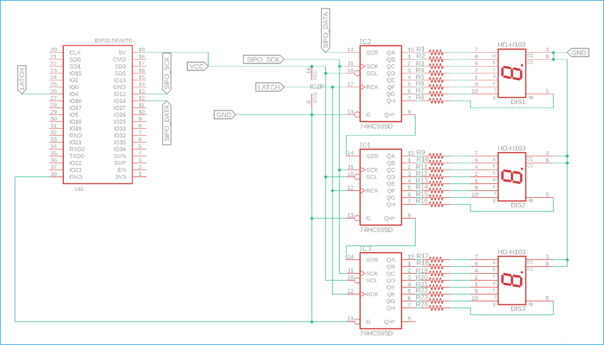

# Lab 1 — 2-Digit Counter on ESP32-S3

An embedded application for the **ESP32-S3** built with **ESP-IDF** and **FreeRTOS**.  
It displays a 0–99 auto-incrementing counter on a 2-digit **7-segment display** (driven via a shift register). A physical button toggles between the live counter and a fixed order number (`14`).

---

## Hardware

| Signal                  | GPIO          |
| ----------------------- | ------------- |
| Button                  | `GPIO_NUM_47` |
| Shift register DATA     | `GPIO_NUM_0`  |
| Shift register CLOCK    | `GPIO_NUM_48` |
| Shift register LATCH    | `GPIO_NUM_45` |
| LED (unused by default) | `GPIO_NUM_2`  |

### Wiring overview

## Instead of using pins in diagram use next pins

```c
#define DATA_PIN       GPIO_NUM_0
#define SHIFT_PIN      GPIO_NUM_48
#define SYNC_LATCH_PIN GPIO_NUM_45
```



```
ESP32-S3
  GPIO_0  ──► DATA  ──┐
  GPIO_48 ──► CLK   ──┤  Shift Register (x2 chained)  ──► 7-segment display
  GPIO_45 ──► LATCH ──┘

  GPIO_47 ──► Button ──► GND  (internal pull-up, ANYEDGE interrupt)
```

---

## Behaviour

- On boot the counter starts at `0` and increments by `1` every second, wrapping at `99 → 0`.
- **Button press** (falling edge, pulled HIGH): freezes the display and shows the fixed order number `14`.
- **Button release** (rising edge): resumes the live counter from where it left off.
- A 500 ms hardware debounce is applied inside the ISR.

---

## Project structure

```
main/
├── main.c                        # Entry point — creates output_counter_task
│
├── output-counter/
│   ├── output_counter.h          # Public API + shared state (counter, useConstant)
│   └── output_counter.c          # Counter loop + orchestration
│
├── button/
│   ├── button.h                  # Button declarations
│   └── button.c                  # ISR, debounce, buttonTask, enable_button_interupt
│
├── display/
│   ├── display.h                 # Display declarations
│   └── display.c                 # display_task, enable_display_task, shift-out logic
│
├── digits/
│   ├── digits.h                  # Segment bitmask macros + extern declaration
│   └── digits.c                  # digits[10] array definition
│
├── shift-out-lsb/
│   ├── shift_out_lsb.h           # Prototype
│   └── shift_out_lsb.c           # Bit-bang 16-bit LSB-first shift out
│
└── blink-led/
    ├── blink_led.h               # Prototype
    └── blink_led.c               # Simple 1 Hz LED blink task (disabled by default)
```

---

## FreeRTOS tasks

| Task                  | Stack | Priority | Responsibility                             |
| --------------------- | ----- | -------- | ------------------------------------------ |
| `output_counter_task` | 2048  | 5        | Counter loop, GPIO setup                   |
| `button_task`         | 2048  | 5        | Reads button queue, updates display        |
| `display_task`        | 2048  | 5        | Reads display queue, drives shift register |

Inter-task communication uses **FreeRTOS queues**:

- `button_queue` (`uint32_t`) — GPIO level from ISR → button task
- `display_queue` (`uint16_t`) — value to show → display task

---

## Building & flashing

### Prerequisites

- [ESP-IDF v5.x+](https://docs.espressif.com/projects/esp-idf/en/latest/esp32s3/get-started/)
- Target: `esp32s3`

### Build

```bash
export IDF_PATH='/path/to/esp-idf'
idf.py set-target esp32s3
idf.py build
```

### Flash & monitor

```bash
idf.py -p /dev/ttyACM0 flash monitor
```

---

## 7-segment encoding

Digits are encoded as bitmasks in `digits/digits.c` using the segment layout:

```
 _
|_|
|_|

Bit 7 (0x80) = TOP_RIGHT
Bit 6 (0x40) = TOP
Bit 5 (0x20) = TOP_LEFT
Bit 4 (0x10) = DECIMAL_POINT
Bit 3 (0x08) = MIDDLE
Bit 2 (0x04) = BOTTOM_RIGHT
Bit 1 (0x02) = BOTTOM
Bit 0 (0x01) = BOTTOM_LEFT
```

The display receives the **bitwise NOT** of the encoded value (active-low segments).  
Two digits are packed into a single `uint16_t`: high byte = tens digit, low byte = units digit.
